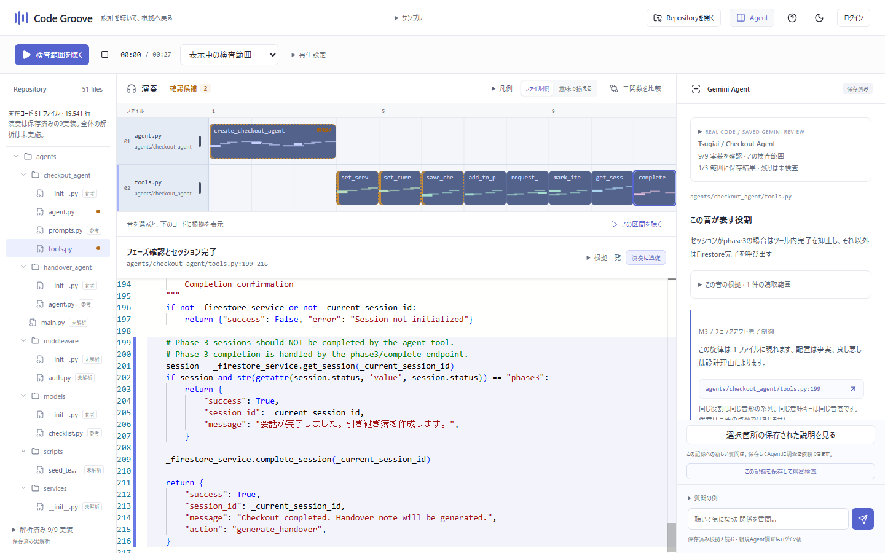
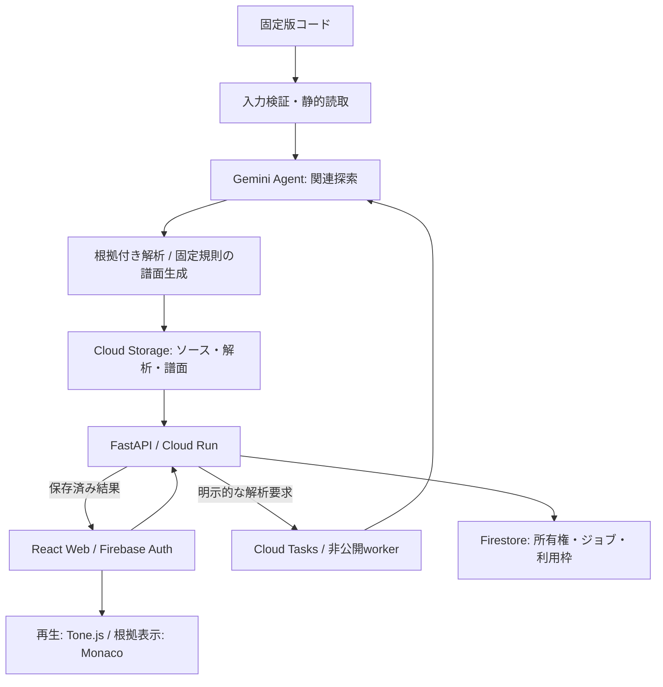
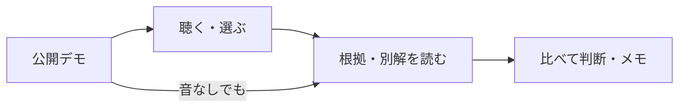

# Code Groove

**書ける速さに、理解する時間を置き去りにしない。**

コードの役割とつながりを聴き、気づきを根拠コードへ戻すレビュー支援ツールです。

[公開サンプルを開く](https://code-groove-web-a5ygiois2a-an.a.run.app) · [音の規則](docs/SONIFICATION.md) · [ドキュメント](docs/README.md)

## エグゼクティブサマリー / Executive Summary

生成AIで実装が進んでも、「この先も安心して直せる設計か」を考える時間は残ります。Code Grooveは、AIが調べたコードの関係を音とタイムラインに表し、人が気になった箇所を確かめるための**コードの健康診断**を目指します。

- **聴いて見つけ、根拠で確かめる。** 同じ役割に同じ旋律を使い、繰り返しや分散を探索の手がかりにします。
- **AIの説明もレビューできる。** 根拠・別の説明・未確認事項を残し、設計の判断を人に返します。
- **実コードで試せる。** 第4回Zennハッカソン提出作Tsugiaiの保存済み解析を、ログインや新しいAI呼び出しなしで体験できます。



## 概要 / Overview

### 動くようになった。その先を、誰が読むか

AIに実装を頼み、バグを直し、画面が動く。できることが増えるのはうれしい一方で、コードが増える速さにレビューが追いつかない。読む側の時間は急には増えません。AI生成コードや既存アプリを引き継ぐ開発者・レビュアーには、「動くこと」に加えて「なぜこの形なのか」を理解する負担が残ります。

たとえば、同じルールが別々の場所にあり、一つだけ直すと食い違う。違う役割が一つの処理に混ざり、変更の影響を追いにくい。こうした設計上の違和感は、今すぐバグにならなくても、後から直す手間が膨らむ**技術負債**につながることがあります。何を揃え、どの例外を残すかは、仕様や将来の変更を踏まえて人が判断したいところです。

### 提供する解決策：コードを聴く、という入口

**ソニフィケーション（可聴化）**は、データの特徴や関係を、言葉による読み上げではなく音で伝える方法です。グラフが数値の違いを形で表すように、音の並びや間隔で関係を表します。[定義と再現性の考え方（ICAD）](https://www.icad.org/Proceedings/2008/Hermann2008.pdf)

Code Grooveでは、Agentがコードの役割である「責務」と処理の関係を調べ、固定規則で譜面にします。同じ責務には同じ旋律を使うため、離れた場所で同じ旋律が現れたり、二つの旋律が交互に現れたりする様子をたどれます。気になった音を選ぶと、対応するコードと説明へ戻れます。

狙いは、技術負債になりそうな構造を確かめるきっかけを増やすことです。**音の違いだけで、欠陥・深刻度・品質は判定しません。** 観察、Agentの解釈、人の判断を区別し、理由のある例外や未調査を「悪いコード」「問題なし」へ決めつけません。

### なぜ音に着目したのか

文字を追い続ける以外の入口があれば、レビューの負担を少し軽くできるかもしれません。音楽として聴きながら関係をたどり、気になったところで読む。別の作業中でも音の変化を探索のきっかけにできることを狙っています。認知負荷や疲労が実際に減るかは、これから測る効果です。

| 工夫 | レビューでできること |
|---|---|
| 同じ責務に同じ旋律、配置と間隔にコードの対応を保持 | 分散・繰り返し・交互の現れ方を比べ、関連箇所を探す |
| 現在位置と根拠コードを結び、確認候補を控えめな印で表示 | 「今どこを聴いたか」から、観察・別の説明・未確認事項へ進む |
| 短い試聴では伴奏と無関係な音を減らす | 音量や不快な警告音で強調せず、対象の関係に集中する |
| 同じ条件で比較し、対応不明を明示 | 何が違ったかをコードと音で説明し、無理な同一視を避ける |

音を使わず根拠だけ読むこともできます。[音とコードの対応規則](docs/SONIFICATION.md)

### 実コードで、何を確かめられたか

[第4回Zennハッカソンの提出作](https://zenn.dev/hackathons/google-cloud-japan-ai-hackathon-vol4?tab=projects)**Tsugiai**は、AIとの対話で業務の引き継ぎを確認するアプリです。その[固定版](https://github.com/kdoai/tsugiai/tree/35a951488d7b00518e7e73a329d46713cbeacbe8)から11ファイルを取り込み、Checkout Agentの9実装を調べました。

このケースでは、対話を組み立てる処理とセッションの状態を更新する処理をたどり、保存・進捗取得など**5つのツールが共有参照を使う**ことをソースで確認できました。「複数の引き継ぎを同時に扱うとき、状態はどう隔離されるか」という、レビューで確かめたい問いを具体化できます。[根拠のツール実装](https://github.com/kdoai/tsugiai/blob/35a951488d7b00518e7e73a329d46713cbeacbe8/agents/checkout_agent/tools.py)

同時に、Agentの「各ツールが大域変数へ直接依存する」という説明には、入力から写真依頼を作るだけの[`request_photo`](https://github.com/kdoai/tsugiai/blob/35a951488d7b00518e7e73a329d46713cbeacbe8/agents/checkout_agent/tools.py#L94-L113)が反例でした。関係を調べる入口は作れても、説明をそのまま信じず、例外と根拠を読む必要があります。並行処理の障害を発見・再現したという結果ではありません。[デモの範囲](docs/TSUGIAI_DEMO.md)・[具体的な根拠と解釈評価](docs/INTERPRETATION_EVALUATION.md)

別の作例では、一般向けと法人向けで返品期限が違う契約を根拠に、処理を一律に統合する案を棄却しています。似ているコードを揃えるだけでなく、理由のある違いを残すためにも使う設計です。

**実装できているのは、実コードの読取 → 根拠を持つ説明と譜面 → 再生位置からソースへの往復です。** コード全体の検証や、音によるレビューの優位性までは実証していません。対象コードを実行・変更せず、保存済みの記録を公開しています。

### 期待される効果

**定性的効果:** 責務のつながりをつかみ、漠然とした違和感を「この箇所とこの根拠を確認したい」に変えることを目指します。比較メモと根拠を使えば、レビューや引き継ぎで、変更する理由・例外を残す理由・まだ分からないことを共有できます。

**定量的効果:** 理解時間・根拠へ到達する時間・違いを正しく説明できた割合・認知負荷と疲労を、コードだけ読む場合と比較する予定です。時間短縮や負担軽減の実測値はまだありません。

解析の説明については、保存済み6件（作例5件・Tsugiai1件）をソースと照合しています。

| 照合対象 | 根拠が説明を支持した件数 |
|---|---:|
| 責務の定義と割当 | 21 / 22 |
| 処理の説明・責務割当・主コード範囲 | 51 / 54 |
| 確認候補の説明・別解・変更シナリオ | 5 / 7 |

残りには部分支持や反例があります。独立した人による正解評価ではなく、選択された過去の出力の照合です。現行Agentの一般的な精度や欠陥検出率、音の効果を示す数値ではありません。[評価条件と個別判定](docs/INTERPRETATION_EVALUATION.md)

## アーキテクチャ・技術スタック



解析対象のコードを実行せず、信頼済みパーサーで静的に読み取ります。保存済み結果の閲覧・再生・静的な構造比較ではモデルを呼び出しません。

| 技術 | 役割 |
|---|---|
| React、TypeScript、Vite | 音・タイムライン・説明をつなぐWeb画面 |
| Monaco Editor、Zustand、TanStack Query | 根拠コードの表示、画面状態とAPIデータの管理 |
| Tone.js、独自の譜面変換 | 責務の旋律を固定規則で生成し、共有音源で再生 |
| Python 3.13、FastAPI、Pydantic | API、入出力の検証、解析ジョブの管理 |
| Python AST、TypeScript Compiler API | コードを実行せず、実装・静的な関係を抽出 |
| Gemini、Google Gen AI SDK、Google ADK | 制限付きツールで関連コードを読み、根拠と解釈を提出 |
| Cloud Run、Cloud Tasks | Webと非公開workerの実行、非同期ジョブの配送 |
| Cloud Storage、Firestore | ソース・解析・譜面、所有権・ジョブ・利用枠の保存 |
| Firebase Auth | 利用者の認証 |
| Vitest、pytest、Playwright | 譜面・API・画面操作の検証 |
| GitHub Actions、Cloud Build、Artifact Registry | 検査後のイメージ作成とGCPへの配備 |

詳細は[技術構成](docs/TECHNICAL_GUIDE.md)と[動作仕様](docs/SPEC.md)を参照してください。

### AI エージェントが生み出す価値

似た処理でも、同じ目的なのか、別の契約に基づく例外なのかで、揃えるべきかは変わります。Agentは関連実装・呼び出し元・テスト・型や契約・文書を探索し、その文脈から責務と処理を説明します。仮説、反証の問い、読んだ行範囲とhash、判断保留を残すことで、人は結論だけでなく、その前提も確かめられます。

明示的に追加調査を依頼すると、関連箇所を読み直し、初回解釈を維持・修正・保留する理由を返します。改善案は差分で示し、人が採用した場合だけアプリ内の新しいスナップショットへ反映します。未読の範囲や実行時の動作は、確認済みとして扱いません。

## 機能一覧 / Features

| こんなときに | できること |
|---|---|
| 初めてのコードを引き継ぎたい | 責務の旋律とタイムラインで配置をたどり、現在位置から実装と説明へ戻る。公開サンプルと保存済み解析を再生できる |
| 気になる箇所の理由を確かめたい | 確認候補の観察・別解・未確認事項をまとめて読み、関連する音だけを最大10秒試聴する。音なしの根拠閲覧も可能 |
| 二つの実装を比べたい | 関数の構造・コードと、根拠のある旋律を同じテンポ・音量設定・小節数で比較する。呼出・return候補・結果の利用箇所もまとめて追える |
| PRの変更を文脈付きでレビューしたい | 同じhead版の保存済み解析に変更行を照合し、関連実装・テスト等の読取根拠・説明へ進む。削除や対応不明、版違いを明示する |
| 自分のコードを調べ、変更を検討したい | TypeScript／TSX・Pythonを新規解析し、追加調査や改善案を依頼する。差分は人が承認し、元リポジトリを変更しない |
| 判断を引き継ぎたい | 期待・観察・疑問・人の確認状態を比較メモに残し、端末保存・JSON書き出しで共有する |

構造比較は`.ts`の限定した関数が対象です。静的な関係は実行時の流れではなく、複数のreturnから実行経路を推測しません。[比較の対象と制限](docs/STRUCTURE_COMPARISON.md)・[呼出・返却・利用の範囲](docs/CALL_RELATIONSHIPS.md)

## 使い方

まずは公開サンプルで、**聴く → 気になる箇所を選ぶ → 根拠を読む**を体験します。



1. [アプリ](https://code-groove-web-a5ygiois2a-an.a.run.app)で「実画面のデモを見る」を開きます。
2. 「検査範囲を聴く」で演奏を始め、責務・実装・行範囲を現在位置の表示で確認します。別のコードを手動で読んだ後は「演奏位置の根拠へ」で戻れます。音や丸印を選ぶと、下に根拠コード、Agent欄に保存された説明が表示されます。
3. 「確認候補」から、観察・別の説明・未確認事項を読みます。「伴奏なしで聴く」で対象に集中でき、音を使わず「根拠行」だけ開くこともできます。
4. 「二関数を比較」やAgent欄の「呼出・返却・利用の根拠」で、気になった関係を確認します。

公開GitHubの保存済み解析では、左の「PRの変更箇所から根拠へ」にPR URLを入力できます。PRのheadと保存版が一致した範囲から、変更行・関連する読取根拠・説明へ進みます。版が違う場合は対応付けを止め、ログイン後の明示操作でhead版を新規解析できます。PRの読取だけではモデルを呼び出しません。[PRの照合範囲と制限](docs/PR_EVIDENCE.md)

公開デモは**保存済み実解析**です。開発用の模擬サンプルとは区別して表示します。再生・閲覧・静的比較で新しいモデル呼び出しは発生しません。

ログイン後、自分の私有コピーを保存して追加調査を依頼できます。新規解析・質問の送信・改善案の依頼にはモデルの利用が発生します。保存だけでは新しいモデル要求を開始しません。私有コピーのアクセス期限は7日です。[データの扱い](docs/data-handling.md)・[利用上限と費用](docs/cost-plan.md)

## ディレクトリ構成

```text
code-groove/
|-- apps/
|   |-- web/            Web画面・コード表示・再生
|   `-- backend/        API・Agent・入力検証・ジョブ・保存
|-- packages/
|   |-- groove-core/    決定的な譜面生成
|   |-- repo-indexer/   TypeScriptの静的索引・構造比較・関係抽出
|   `-- contracts/      生成したTypeScript契約
|-- contracts/          生成したJSON Schema
|-- fixtures/           模擬例・保存済み実解析・同梱ライセンス
|-- assets/
|   `-- audio-source/   音源の出典・ライセンス・固定hash
|-- tests/              単体・API・ブラウザの検証
|-- scripts/            開発起動・生成・検証・リリース
|-- infra/              GCPとGitHubの配備設定
`-- docs/               仕様・使い方・開発・運用
```

## セットアップ / Getting Started

Node.js 24、pnpm 10.27.0、Python 3.13、uvが必要です。依存は`pnpm-lock.yaml`と`uv.lock`に固定しています。リポジトリのルートで実行します。既存の`.env`がある場合はコピーを省略してください。

```powershell
Copy-Item .env.example .env
pnpm install --frozen-lockfile
uv sync --locked
pnpm build:tools
```

端末1でAPIとローカルworkerを起動します。以下の設定では模擬Agentとローカル保存を使い、有料モデルを呼び出しません。

```powershell
$env:PYTHONPATH='apps/backend'
$env:ENVIRONMENT='local'
$env:APP_ROLE='web'
$env:MODEL_MODE='fixture'
$env:STORE_MODE='local'
$env:ENABLE_LIVE_ANALYSIS='false'
uv run python scripts/dev.py
```

端末2でWebを起動します。

```powershell
pnpm dev:web
```

[http://127.0.0.1:5173](http://127.0.0.1:5173)を開きます。APIは8080を使います。終了は両端末でCtrl+Cです。ブラウザテストは`pnpm exec playwright install chromium`で準備し、`pnpm test:e2e`で実行できます。その他の検証と契約生成は[開発手順](docs/DEVELOPMENT.md)を参照してください。

## 環境変数一覧

ローカルの公開サンプル閲覧は、同梱の初期値で起動できます。実解析とGCP保存は別途接続設定が必要です。`.env`と実行データの`.local/`はGit管理外です。

| 変数名 | 用途 | 必須となる条件 | サンプル値 |
|---|---|---|---|
| `ENVIRONMENT` | 実行環境 | 任意・初期値local | `local` |
| `APP_ROLE` | Web／worker | 任意・初期値web | `web` |
| `MODEL_MODE` | 模擬／実モデル | 任意・初期値fixture | `fixture` |
| `ENABLE_LIVE_ANALYSIS` | 実解析の有効化 | 実解析 | `false` |
| `GEMINI_MODEL` | 実モデルのID | 実解析・初期値あり | `gemini-3.8-flash` |
| `MODEL_AUTH_MODE` | ADC／Express認証 | 実解析・初期値adc | `adc` |
| `GOOGLE_CLOUD_PROJECT` | GCPプロジェクト | ADC実解析・GCP保存 | `example-project` |
| `GOOGLE_CLOUD_QUOTA_PROJECT` | SDKの割当プロジェクト | 接続設定に応じて | `example-project` |
| `GOOGLE_CLOUD_LOCATION` | モデルの接続先 | 実解析・初期値global | `global` |
| `GOOGLE_CLOUD_API_KEY` | Expressモードのキー | Express実解析のみ | `<YOUR_API_KEY>` |
| `GCP_REGION` | アプリのリージョン | GCP配備 | `asia-northeast1` |
| `STORE_MODE` | ローカル／GCP保存 | 任意・初期値local | `local` |
| `LOCAL_DATA_DIR` | ローカル保存先 | ローカル・初期値あり | `.local` |
| `ARTIFACT_BUCKET` | スナップショットと成果物の保存先 | GCP保存 | `example-artifacts` |
| `FIRESTORE_DATABASE` | Firestoreデータベース | GCP保存・初期値あり | `(default)` |
| `PUBLIC_BASE_URL` | Webの基準URL | 任意・初期値あり | `http://localhost:5173` |
| `WORKER_URL` | 非公開workerのURL | GCPジョブ処理 | `https://worker.example.com` |
| `TASKS_QUEUE` | Cloud Tasksキュー | GCPジョブ処理・初期値あり | `cg-analysis` |
| `TASKS_INVOKER_EMAIL` | Tasksの呼出用サービスアカウント | GCPジョブ処理 | `tasks@example-project.iam.gserviceaccount.com` |
| `FIREBASE_API_KEY` | FirebaseのWeb認証設定 | ログイン・本番Web | `<FIREBASE_WEB_API_KEY>` |
| `FIREBASE_AUTH_DOMAIN` | Firebase認証ドメイン | ログイン | `example-project.firebaseapp.com` |
| `FIREBASE_APP_ID` | Firebase WebアプリID | ログイン | `<FIREBASE_APP_ID>` |

本番の実モデル接続はADCと実行サービスアカウントを使います。認証情報は非公開の管理先で扱います。

## デプロイ / Deployment

GitHub Actionsの[CI workflow](.github/workflows/ci.yml)は、PRでコード検証とSecret scanを実行します。**mainへのpush・マージ後、両方の成功を条件に本番へ自動デプロイ**します。

Workload Identity FederationでGCPへ認証し、Cloud Buildでcommit SHAをタグにしたイメージを作成します。Artifact Registryから東京のCloud Run web・非公開workerへ同じイメージを配備し、revision・トラフィック・ヘルス・アクセス制御・公開サンプルを確認します。PRからの本番配備は行いません。

[配備workflow](.github/workflows/deploy.yml) · [CI/CDの詳細](docs/CI_CD.md) · [復旧と運用](docs/runbook.md) · [費用計画](docs/cost-plan.md)

## ライセンス / License

アプリ本体の再利用ライセンスは未指定です（ルートの`LICENSE`なし）。公開リポジトリの閲覧と、コードを再利用・再配布できることは区別してください。第三者コード・音源には、以下の条件が適用されます。

| 対象 | ライセンス・出典 |
|---|---|
| Tsugiaiの保存済みサンプル・参考ソース | MIT · [同梱ライセンス](fixtures/licenses/tsugiai-LICENSE.txt)・[参考ソースのライセンス](fixtures/repository-reference/TSUGIAI_LICENSE.txt) |
| 録音Bass・Piano | CC BY 3.0。Karoryfer／VSO2、編集Nicholaus P. Brosowsky。出典・著作者・ライセンスURL・加工内容を[クレジット](apps/web/public/audio/midnight-jazz-v4/NOTICE.txt)に保持 · [取得元の条件](assets/audio-source/LICENSE.txt) |
| Code Grooveで作成したVibes等 | [音源クレジット](apps/web/public/audio/midnight-jazz-v4/NOTICE.txt)でMITと記載。アプリ全体のライセンス指定ではない |
| Webの依存ライブラリ | ビルドで本文一覧を生成し、Firebase・Monacoの補足文書も同梱 · [配布物の一覧](https://code-groove-web-a5ygiois2a-an.a.run.app/THIRD_PARTY_LICENSES.md)・[補足条件](docs/LICENSES.md) |

呼出・返却・利用をまとめる発想は[SoundCoding2026の固定版](https://github.com/kouduki1101/SoundCoding2026/tree/3261ef988c57c5be1c42e5d0ee42182542759c84)、現在位置とPRからの導線は[Codelodyの固定版](https://github.com/yuki-kobayashi-git/codelody/tree/a06d888dba2906994283afeb13b191b28b76ca00)を参考にしました。両者のコード・音源は流用していません。

再配布時の条件と確認範囲は[ライセンスと第三者素材](docs/LICENSES.md)を参照してください。
