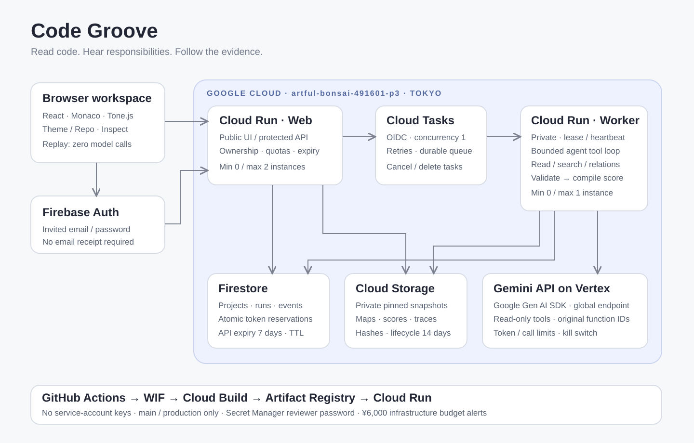

# Code Groove — current architecture (R15)

Browser（React / TypeScript / Monaco / Tone.js）→ Cloud Run web API → Cloud Tasks → private worker。メタデータはFirestore、不変ソース・map・譜面は非公開Cloud Storage、認証はFirebase Authです。東京・scale to zeroを維持します。

workerはADK 2.11.0の単一custom BaseAgent／InMemoryRunnerを使います。Gemini adapterはGoogle Gen AI SDK clientを受け取り、1要求1応答で呼びます。ADK標準の自動ツールループを重ねず、Code Grooveの制御ループが予算、停止、読取receipt、提出schemaを検証します。既存の耐久ジョブ、90秒lease、heartbeat、CAS公開、再試行、予約・清算を保持します。

主な責務の境界：

| 領域 | 実装 |
|---|---|
| Agentの提出・探索・予算 | `agent.py` |
| read-onlyツール・context・receipt | `agent_tools.py` |
| ADK実行／モデル境界 | `agent_runtime.py` / `adk_adapter.py` |
| 所有権付きAPI／耐久ジョブ | `app.py` / `jobs.py` |
| 範囲・依存fingerprint | `repository.py` |
| 選択範囲の意味統合境界 | `reconciliation.py` |
| Python静的構文と所有関係 | `python_indexer.py` |
| Pydantic・根拠検証 | `schemas.py` / `validation.py` |
| 音の規則 | `packages/groove-core/src/compiler.ts` / `arrangement.ts` |
| ツリー／演奏／主デモ | `RepositoryTree.tsx` / `Arrangement.tsx` / `DemoComparison.tsx` |
| UIの合成 | `ReviewWorkspace.tsx` / `App.tsx` |
| 独立構文投影・順序対応 | `packages/repo-indexer/src/structure.ts` |
| 構造譜面・中立音源 | `packages/groove-core/src/structure.ts` / `structure-sound.ts` |
| 比較選択・今回の根拠検証 | `structure.py` / `comparison-system-v1.txt` |
| 構造比較UI・端末内記録 | `StructureComparisonPanel.tsx` / `comparisonState.ts` / `audio/structurePlayer.ts` |

CSSはbase・studio・workspace・review・demoに分割し、既存cascade順を保持しています。大きいAPIとJobServiceを無理に同時全面改稿せず、意味統合とモデル実行を独立境界へ切り出しました。

`prompts/conductor-system-v1.txt`というパスは互換性のため保持し、論理版はv14です。名前による版の推測を避け、mapとcacheにprompt_versionを保存します。旧解析のorigin・prompt・scopeは更新しません。音だけ現行文法へcompileし直します。

[現行仕様](SPEC.md) / [意味と音](SONIFICATION.md) / [検証](acceptance.md)。旧説明は[履歴](history/R13/TECHNICAL_GUIDE.md)です。

R15の構造投影・譜面は意味解析map／ScoreSceneとは別の生成経路です。サーバーが不変ソースを信頼されたNodeパーサーへ渡し、独立契約で検証します。比較用調査入口はscene_idを使わず、既存investigationジョブとして同じ予算・取消・read tool・CASを通ります。結果は別の比較記録に結び付け、従来の意味再分類には採用できません。端末メモ・JSONはクラウドDBへ送らず、人が追加調査を押したときの期待／観察／疑問だけを調査要求に含めます。[詳細](STRUCTURE_COMPARISON.md)。
